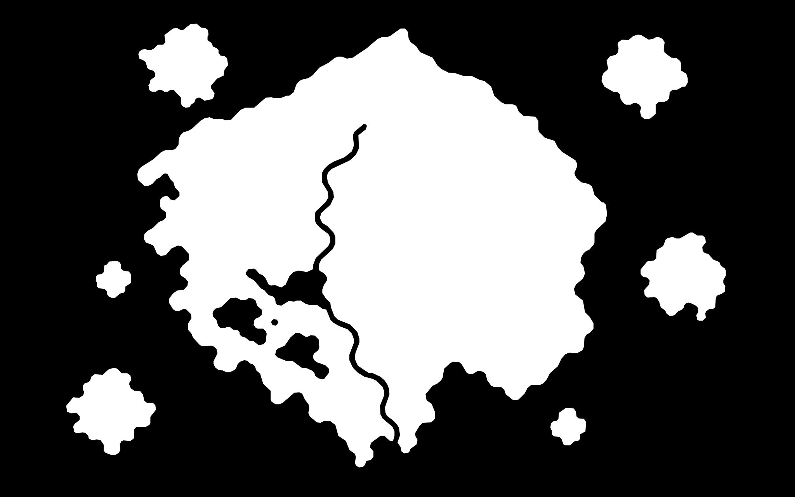

# ワールドマップ座標・確定版

UNTOLD世界 **オルバ** の開発用ワールドマップの確定基準。

## 確定基礎地形マスク

- 基礎地形マスクは `assets/elden-terrain-mask-final.svg` を正とする。
- 世界キャンバスは `16000 × 10000px`。
- 原点は左上 `(0,0)`。xは右方向、yは下方向に増加する。
- 基礎マスクの輪郭、島配置、内陸水系の大形状は変更しない。
- 地形、町、道路、施設は基礎マスクの上に別レイヤーとして配置する。

## 地形割り当て

地形割り当てと町配置の詳細は `pages/world/terrain-allocation-final.md` を正とする。

地形種類は次の8種類で確定する。

- 草原
- 森林
- 山岳
- 高原
- 湿地
- 荒野
- 川（河川・湖・湖沼などの内陸水域を含む）
- 海

`沿岸` は独立地形として使用しない。

主島の地形は、北部＝山岳、西部＝森林、中央〜南中央＝草原、北東＝高原、東〜南東＝荒野、南西＝湿地で確定する。

## 地形構成

- 主島：1つ。正式名称は付けない。
- 周辺島：6つ
  - **ブリガン島**：北西の有人島
  - **ペスカラ島**：東の有人島
  - **セトラ島**：北東の大型無人島
  - **ピッコ島**：西沖の小型無人島
  - **名称未確定の火山島**：南西沖の大型無人島
  - **ササラ島**：南東沖の小型無人島
- 合計陸地数：7

## 主島の水系

- 南西部には複数の湖・湖沼からなる水域が存在する。
- 主河川は北部寄りから南西湖沼方面へ伸び、湖沼水系と接続した後、南へ流れる。
- 河口はポルトナの西側に位置し、南岸の海へ直接つながる。
- 川・湖・湖沼は内陸水域として「川」地形にまとめ、外海とは区別する。

## 主島8町

| 町 | 座標・配置 | 地域 |
|---|---|---|
| カルドラント | `(8,000,2,000)` | 北部山岳 |
| オルメド | `(5,200,3,800)` | 西部森林 |
| エルド | `(8,000,4,200)` | 中央草原北寄り |
| ハルクァ | `(10,700,3,700)` | 北東高原 |
| レグナ | `(8,400,6,000)` | 中央草原南寄り |
| リュメイ | `(6,000,6,100)` | 南西湿地 |
| モルグレイ | `(11,200,6,100)` | 東〜南東荒野 |
| ポルトナ | `(8,500,7,750)` | 南岸・主河川河口東側 |

## 周辺有人島

- **ブリガン島**：北西有人島。町スカルドの正式座標は `(3,400,1,350)`。
- **ペスカラ島**：東有人島。町ボナペの基準座標は `(14,600,5,800)`。

## MAP表示ルール

- プレイヤー開始時点では完成地図を表示しない。
- 実際に移動・探索した範囲だけをMAPへ記録する。
- 道、地形、海岸線、町・施設も、発見または接近した範囲だけを表示する。
- 別島も未発見状態では正確な位置・輪郭を表示しない。

## 確定事項

- 世界全体の正式名称は **オルバ**。
- 基礎地形マスク
- 7陸地構成
- 8種類の地形分類
- 主島の地形割り当て
- 主島には正式名称を付けない
- ブリガン島、ペスカラ島、セトラ島、ピッコ島、ササラ島の名称
- 南西沖大型無人島を火山島とすること
- 町の地理上の配置
- レグナの基準座標 `(8,400,6,000)`
- ポルトナの正式座標 `(8,500,7,750)`
- 主河川が南西湖沼水系を経てポルトナ西側から外海へ流入する構造
- 探索済み範囲だけを記録するMAP方式

## 後から決めるもの

- 南西沖大型火山島の正式名称
- 無人島4島の具体的な用途・内容（火山島であること以外）
- 川幅、支流、橋、渡河地点の詳細
- 航路と船移動の所要時間
- MAPへ記録される探索半径・判定方式
